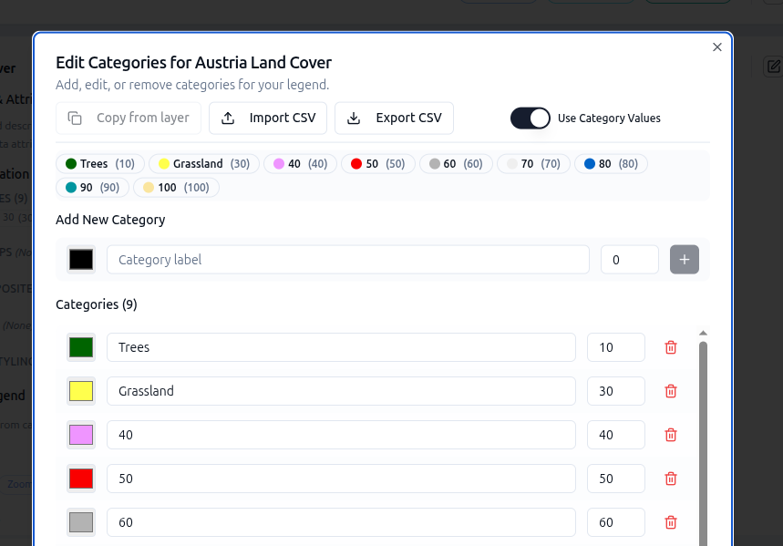

# 5-4. Categories for a WMS layer

Set up categories manually for the World Cover WMS you added earlier.

1. On the **Layers** tab, edit the *World Cover* layer card you created in
    [Add a WMS layer directly](../02-getting-started/09-wms-service.md).
2. Scroll down and select **Add categories**. The categories editor opens.
3. Toggle **Use data values** on. An additional column appears for the raw
    pixel values.
4. Add your first category — for example, colour `#006400`, label `Tree cover`,
    value `10`.
5. Open the categories editor from the layer card by navigating to **Data Visualisation → Categories → Edit**.

    

    Add another category — colour `#ffff4c`, label `Grassland`, value `30`.
6. Save the layer card and preview. When you fill in the full set of World
    Cover classes, the legend in the Explorer will contain a row per class.

You do not need to fill in every category now — a handful is enough to see how
it works. See the full WorldCover class lookup in
[5-3. Categories for a COG](03-categories-cog.md#worldcover-class-lookup).

