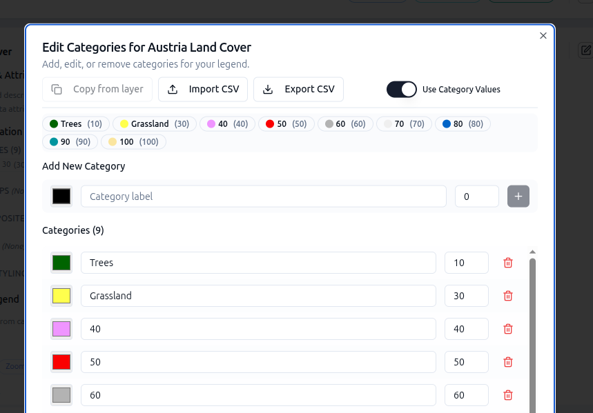

# 5-4. Categories for a WMS layer

Now we will update the _World Cover_ WMS layer you created in
[2-9. Add a WMS data source](../02-getting-started/09-wms-service.md).

Unlike a COG, a WMS or WMTS service cannot be interrogated for its pixel
values — there is no way to sample the underlying data,so the class numbers
are not available. Sometimes the WMS services return a legend, but if not (like this one), we can still use the categories tool to create the legend.

You can manually define the categories using the dialogue in the same way as we did in 5-3, or import from a CSV. However, because we already defined a full category set on the COG layer, we can simply copy it across.

1. On the **Layers** tab, expand _World Cover 2021_ layer card, go to **Data Visualisation → Categories → Edit**, and choose **Copy from layer** and select
   **Austria Land Cover** (the COG layer from
   [5-3. Categories for a COG](03-categories-cog.md)).

   

2. **Save categories** to return the layer card and then **Preview**. The legend in the Explorer now contains a
   row per class, using the colours and labels you copied.

   If in the last tutorial you only edited the class names that the COG
   populated, you will not have **Shrubland** or **Mangroves** here — neither
   class is present in Austria, so they were never sampled. If you imported
   the CSV, the full set will be there.

   An alternative for this WMS layer is therefore to import the categories
   directly from
   [`world-cover-classes.csv`](../../assets/world-cover-classes.csv), as
   described in [5-3 step 5](03-categories-cog.md).

3. _(Optional)_ Open the categories editor again and untoggle **Use category
   values**. Save the layer card and preview. The legend still shows the class
   labels and colours, but the numeric values are no longer displayed — this
   reflects the fact that class numbers cannot be read from a WMS or WMTS
   layer.

4. _(Optional)_ In the categories editor, change the colour for one of the
   classes and save. The legend in the Explorer will now show the new colour
   for that class. However, for WMS / WMTS layers the actual map styling is
   determined by the service, so the rendered tiles will not change.

See the full WorldCover class lookup in
[5-3. Categories for a COG](03-categories-cog.md#worldcover-class-lookup).
