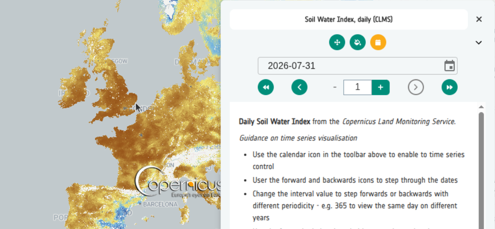

# 5. Categorical Data

## Tutorial Objectives

Configure categories for WMS and COG layers, use the JSON editor for bulk
edits and copy categories between layers.

By the end of this tutorial you will be able to:

- Define categories for a WMS layer so the Explorer renders a legend.
- Define categories for a COG so raw pixel values are rendered by class.
- Use the JSON editor to make bulk category edits.
- Copy categories between layers.

## Steps

- [5-1. Pre-requisites](01-prerequisites.md)
- [5-2. Key concepts](02-key-concepts.md)
- [5-3. Categories for a COG](03-categories-cog.md)
- [5-4. Categories for a WMS layer](04-categories-wms.md)
- [5-5. Use the JSON editor](05-categories-json-editor.md)
- [5-6. Copy categories between layers](06-copy-categories.md)
