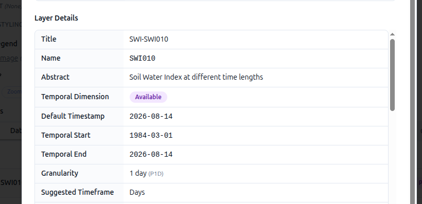
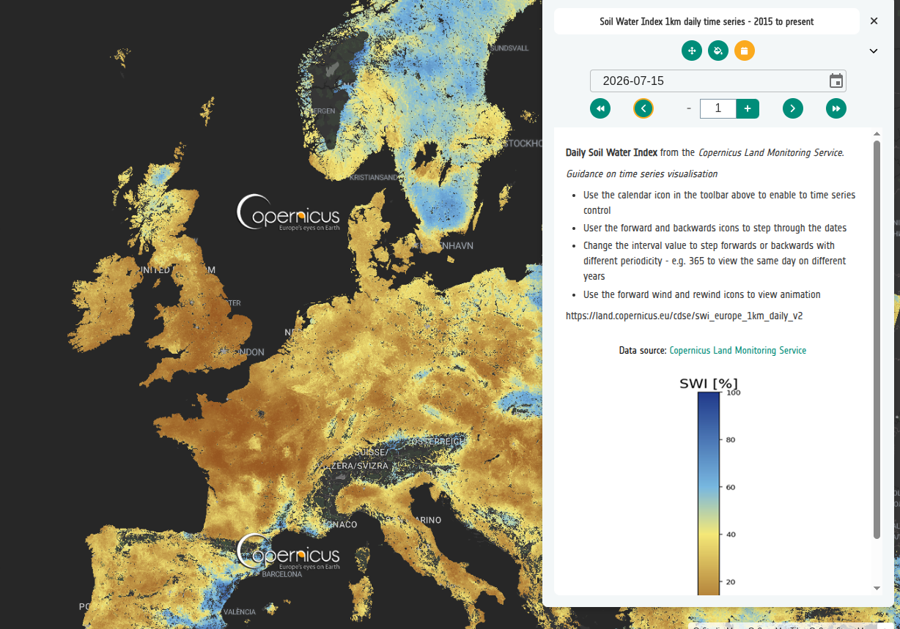
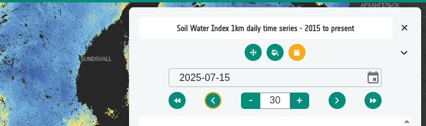

# 6-6. Using WMS / WMTS time parameters

Some services expose time through a `TIME` parameter on a single layer, rather
than as separate layers. In that case the Geospatial Explorer can drive the
temporal control directly from the service.

1. Create a new interface group called **Soils**, and inside it a layer card
   called **Soil Water Index Daily Time Series**.
2. In the layer **Controls**, add **Temporal Control → Days**.
3. Select **+ Add dataset → Direct Connection → Add WMTS**. Note that this is
   **WMTS**, not WMS.
4. Enter the source URL:

    ```
    https://land.copernicus.eu/cdse/swi_europe_1km_daily_v2/
    ```

5. Enter the layer name:

    ```
    SWI010
    ```

6. Note that the **Use TIME parameter** toggle is enabled — the builder has
   detected that the service advertises a time dimension for this layer.
7. After adding the dataset, click the **(i)** icon on the dataset row to open
   the metadata. This shows the temporal extent and the granularity advertised
   by the service.

    

8. Open **Units and Legend**, set **Legend type** to **Image** and paste in:

    ```
    https://land.copernicus.eu/en/cdse-legends/clms_global_swi_12-5km_v3_10daily.png/@@images/image-89-5435993c0267e2917be79312734cfade.png
    ```

9. Save and click **Preview**. The layer has a daily temporal control, and the
   official CLMS legend graphic is shown alongside it.

    

!!! tip

    To see how the soil changes month on month throughout the year, increase the
    **Increment steps** value to **30**. The time series will then jump forward
    30 days at a time, making it easier to compare monthly conditions.

    

### Did you remember to export?

If not, now is a good moment.
