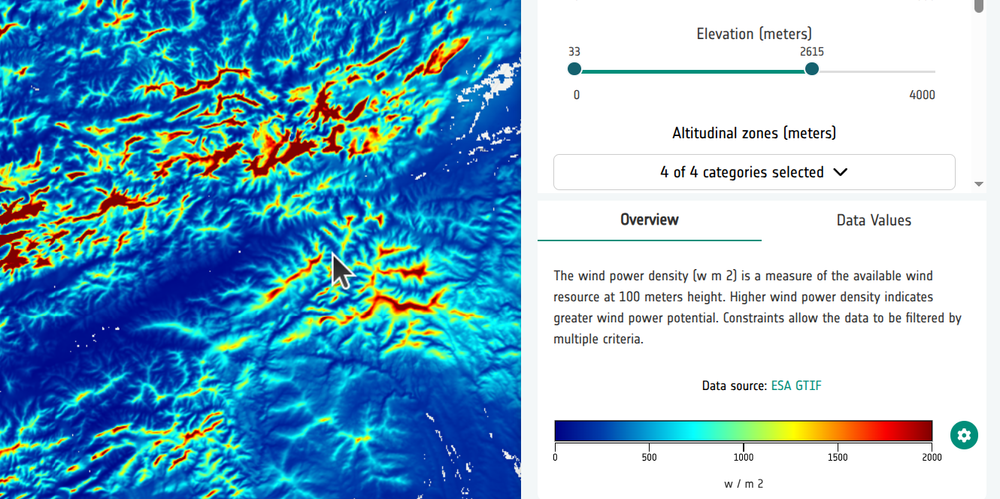

# 6. Time Series

## Tutorial Objectives

Configure the temporal control with manual timestamps, STAC datetimes and
WMS / WMTS time parameters.

By the end of this tutorial you will be able to:

- Attach manual timestamps to datasets.
- Use STAC item datetimes to drive the temporal control.
- Configure WMS / WMTS `TIME` parameters.
- Choose the right granularity for continuous and discontinuous sequences.

## Steps

- [6-1. Pre-requisites](01-prerequisites.md)
- [6-2. Key concepts](02-key-concepts.md)
- [6-3. Manual timestamps](03-manual-timestamps.md)
- [6-4. Using STAC timestamps](04-stac-timestamps.md)
- [6-5. Manual timestamps on WMS / WMTS](05-manual-wms-timestamps.md)
- [6-6. Using WMS / WMTS time parameters](06-wms-timestamps.md)
