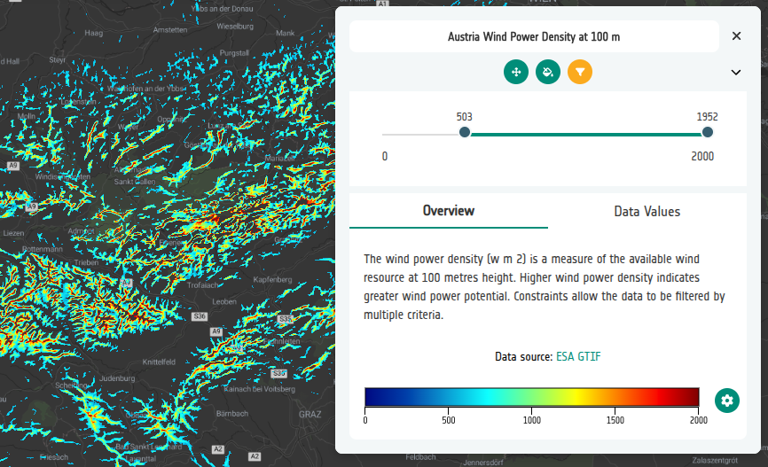

# 7-3. Add the wind power layer

Before adding constraints we need something to constrain. In this step we build
a single COG layer showing wind power density at 100 m over Austria.

1. In the **Layers** tab, add a new **Interface Group** called `Energy`, then
   **Add layer** inside it and name the layer
   `Austria Wind Power Density at 100m`.

2. Add a **COG** data source with this URL:

   ```
   https://eox-gtif-public.s3.eu-central-1.amazonaws.com/DHI/PowerDensity_100m_Austria_WGS84_COG_clipped_3857_fix.tif
   ```

3. Open **Data Visualisation → Colormaps → Edit** and add a colormap:

   | Setting | Value |
   | ------- | ----- |
   | Name    | `jet` |
   | Min     | 0     |
   | Max     | 2000  |
   | Steps   | 50    |
   | Reverse | off   |

4. In the layer card **Controls**, enable:

   - **Opacity slider**
   - **Zoom to centre**
   - **Constraint slider**

   Leave **Temporal controls** and **Blend controls** unchecked, then close the dialogue.

   !!! warning "Constraint slider"
   Without the **Constraint slider** control the constraints you add in
   the rest ot this tutorial steps will be saved to the configuration but will never
   appear in the viewer.

5. To avoid you having to constantly zoom for the rest of this tutorial,go to **Settings → Navigation** and pick **Austria** from the quick location list.

6. Open **Preview** and toggle the layer on. You should see a jet colour ramp
   over Austria with a gradient legend,and a **Filter** icon in the layer card, which looks like a _funnel._

7. Click on the filter, then **drag the slider** values. See how this effects the display of the wind power laye.

   

8. **Optional — polish the layer and the start location.**

   In the layer **Metadata**, set:

   - **Description** — copy in the following text:

     ```
     The wind power density (w m 2) is a measure of the available wind
     resource at 100 metres height. Higher wind power density indicates
     greater wind power potential. Constraints allow the data to be filtered
     by multiple criteria.
     ```

   - **Units** — `w / m 2`
   - **Attribution** — text `ESA GTIF`, URL
     [https://gtif.esa.int/](https://gtif.esa.int/){:target="_blank"}

### Did you remember to export?
