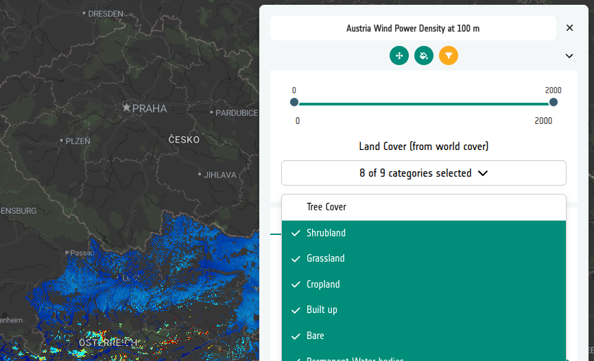

# 7-4. Create a categorical constraint

## The principle

A **categorical** constraint works on data made up of discrete coded values —
here, the ESA WorldCover land cover classes where `10` is tree cover, `20` is
shrubland, and so on. Each value becomes a checkbox in the viewer, and the wind
power data is only drawn where the land cover pixel matches one of the ticked
values.

The values you enter must match the pixel codes in the constraint COG exactly —
the labels are only for display.

## Configure it

1. On the *Austria Wind Power Density at 100m* layer card, click on the
   **Constraints** tab.

2. Select **Add constraint**, keep the source type as **Direct URL** and paste
   the WorldCover COG that has been prepared to align with the wind power data:

    ```
    https://esa-apex.s3.eu-west-1.amazonaws.com/APEX-example-data/constraints/PowerDensity_100m_Austria_WGS84_COG_clipped_3857_fix-esa_worldcover_2021.tif
    ```

3. Set:

    - **Label** — `Land Cover (from World Cover)`
    - **Interactive** — on
    - **Constraint Type** — **Categorical**

4. Select **Populate Categories from COG**. The builder reads the distinct
   values present in the file and creates a row for each one.

5. Edit the labels so they read as class names rather than numbers:

    | Label | Value |
    | --- | --- |
    | Tree cover | 10 |
    | Shrubland | 20 |
    | Grassland | 30 |
    | Cropland | 40 |
    | Built-up | 50 |
    | Bare | 60 |
    | Snow and ice | 70 |
    | Permanent water bodies | 80 |
    | Herbaceous wetland | 90 |
    | Moss and lichen | 100 |

    This is the same class list used in
    [5-3. Categories from a COG](../05-categorical-data/03-categories-cog.md),
    and is also available as a
    [CSV file](../../assets/world-cover-classes.csv).

    !!! note
        Not every class is present in Austria. Values that the COG does not
        contain simply never mask anything, so it is harmless to leave them in.

6. **Save** the constraint.

## View the result

Open the **Preview**. The layer now has a set of land cover checkboxes. Untick
everything except **Cropland** and **Grassland** — the wind power density is
now only rendered over agricultural land, which is a reasonable first pass at
where turbines could actually be sited.



### Did you remember to export?
