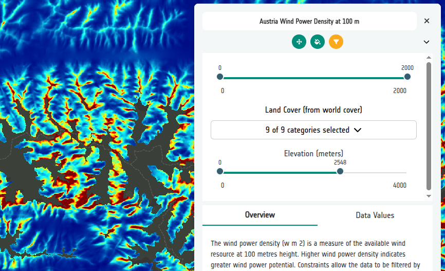

# 7-5. Add a continuous constraint

## The principle

A **continuous** constraint works on a variable that spans a full numeric range
— elevation, slope, distance, temperature. Instead of checkboxes the viewer
renders a two-handled slider, and the layer is only drawn where the constraint
value falls between the two handles.

Here we constrain the wind power density by elevation, using a Copernicus DSM
that has been prepared to match the wind power grid.

## Configure it

1. In the **Constraints** tab of the *Austria Wind Power Density at 100m* layer
   card, select **Add constraint**.

2. Keep the source type as **Direct URL** and paste:

    ```
    https://eox-gtif-public.s3.eu-central-1.amazonaws.com/DHI/Copernicus_DSM_COG_10m_3857_fix.tif
    ```

3. Set:

    - **Label** — `Elevation`
    - **Interactive** — on
    - **Constraint Type** — **Continuous**

4. Select **Populate Min & Max from COG**. The builder reads the statistics
   from the file and fills in the range.

5. Round the values to `0` and `4000` so the slider has sensible stops, and set
   **Units** to `meters`.

6. **Save** the constraint.

## View the result

Open the **Preview** and drag the **Elevation** slider. As you pull the upper
handle down, the high alpine areas drop out of the layer — useful, because the
strongest modelled winds are often on summits where a turbine could never be
built or connected.



!!! tip "Units matter"
    The units string is shown next to the slider values in the viewer. Without
    it a user has no way to know whether `4000` means metres or feet.

### Did you remember to export?
