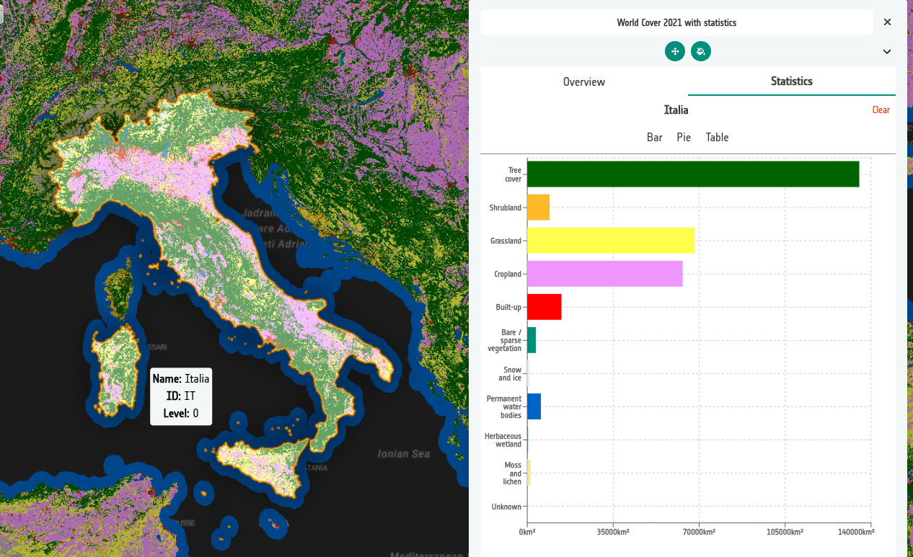

# 8-4. Add the first statistics source

Statistics sources are added from their own tab, not alongside the display
data.

1. On the `World Cover 2021 with statistics` layer card, open
   **Data Sources** and select the **Statistics** tab.

    

2. Click **Add source** and choose the format **FlatGeoBuf**.

    !!! note "Supported formats"
        Statistics sources must be **FlatGeoBuf** or **GeoJSON**. FlatGeoBuf is
        preferred: it is indexed, so the Explorer only downloads the features
        in view.

3. Paste in the NUTS level 0 (country) file:

    ```
    https://esa-apex.s3.eu-west-1.amazonaws.com/APEX-example-data/HI-RES-NUTS/stats.esa_worldcover_2021.nuts_2024.epsg4326.level00.fgb
    ```

4. Note the **level** field. This is the first statistics source on the layer,
   so it is pre-filled with `0` — the coarsest boundaries. Leave it as it is.

5. The **zIndex** is set to `100`, above the display data, so that the clickable
   boundaries sit on top of the raster. Leave it as it is.

6. **Save** the source. It now appears under **Statistics**, separately from the
   WMS source on the **Data** tab.

Open the **Preview**, select the **Statistics** tab and click a country — you
should see the land cover breakdown for that whole country:



!!! warning "Coordinate reference system"
    These files are published in EPSG:4326, matching the `epsg4326` in the file
    name. Statistics features must be in a CRS the Explorer can reproject to the
    map — a mismatch shows as boundaries in the wrong place, or no clickable
    features at all.

### Did you remember to export?
