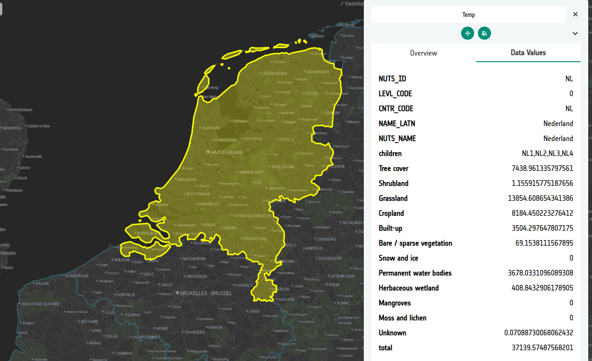

# 8-6. Understanding the statistics files

The statistics you just saw are not calculated by the Explorer. They are read
straight from the attributes of the NUTS features. To see that for yourself,
load one of the same files as ordinary vector data.

1. Add a new layer and name it `Temp`.

2. On the `Temp` layer card, select **+ Add dataset** under the data sources tab. Choose **Direct connection** and the format **FlatGeoBuf**. **Do not** toggle the _statistics_ option on,as this time we want to see the data as a standard vector dataset. Here is the URL to the file:

   ```
   https://esa-apex.s3.eu-west-1.amazonaws.com/APEX-example-data/HI-RES-NUTS/stats.esa_worldcover_2021.nuts_2024.epsg4326.level00.fgb
   ```

3. **Save** the source and open the **Preview**, turning the `Temp` layer on.
   The country boundaries are drawn as a normal vector layer.

4. Select the **Data Values** tab in the panel and click on a country. The
   feature's properties are listed in full.

   

   Look at what is there. Alongside the descriptive fields — country and
   region names, NUTS codes, level — are the pre-computed class areas for
   each World Cover class. These attributes are exactly what the
   **Statistics** tab reads and charts under the bonnet; the only difference
   is that a statistics source is interpreted as a summary to plot, rather
   than as a layer to draw.

5. _Optional_: In step 2 you recall there was a statistics toggle. Adding a data source and toggling this on, does exactly the same as using the statistics tab. In fact if you repeat step 2 and this time toggle that on, then when you come to Preview, you will also see the statistics tab. If you click on this, you will see the statistics as before. However as we do not have our World Cover categories on this layer, you will just see these all use a default colour scheme.

6. Delete the `Temp` layer when you are done — it was only there to look inside
   the file.

   !!! tip "Building your own statistics files"
   Any FlatGeoBuf or GeoJSON of zones will work as a statistics source, as long
   as each feature carries the pre-computed values as properties and the file
   is published in a CRS the Explorer can reproject.

### Did you remember to export?
