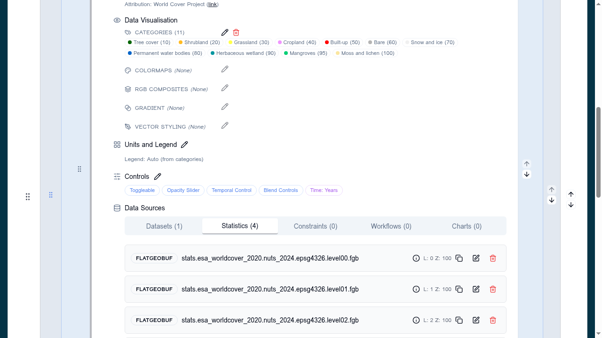

# 8. Statistics

## Tutorial Objectives

Add pre-computed zonal statistics to a land cover layer, so users can click an
administrative area and see a breakdown of the data within it.

By the end of this tutorial you will be able to:

- Explain how statistics sources differ from a layer's display data.
- Add vector (FlatGeoBuf) statistics sources to a layer.
- Use the **level** property to serve different boundary detail at different
  zooms.
- Configure the layer so the **Statistics** tab is useful in the Explorer.
- Review and troubleshoot the resulting configuration.

## Steps

- [8-1. Pre-requisites](01-prerequisites.md)
- [8-2. Key concepts](02-key-concepts.md)
- [8-3. Add the World Cover layer](03-world-cover-layer.md)
- [8-4. Add the first statistics source](04-first-statistics-source.md)
- [8-5. Add the remaining NUTS levels](05-more-statistics-levels.md)
- [8-6. Panel and controls](06-panel-and-controls.md)
- [8-7. Preview and review](07-preview-and-review.md)
