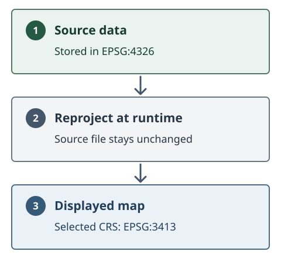

# 9-2. Key concepts

- A **CRS** (Coordinate Reference System) is essentially a **map projection** —
  the mathematical recipe for flattening the curved surface of the Earth onto a
  flat map. Because there is no single "right" way to do this, many different
  CRS exist, each suited to different regions, scales and purposes.
- By default the Geospatial Explorer displays maps in **EPSG:3857**, also known
  as **Web Mercator**. This is the most common CRS for web mapping services
  worldwide — it is what tile services like OpenStreetMap and most commercial
  basemaps use — which is why it is the Explorer's default.
- The Explorer can **reproject data between supported projections**. If a
  dataset is stored in a different CRS, it is transformed at runtime so that it
  lines up correctly with everything else on the map.

    

- This means you are not limited to data stored in Web Mercator: you can use
  datasets kept in another projection, **and/or change the CRS used for
  display** — for example a polar stereographic view when working with Arctic
  data (see [9-3](03-using-an-alternative-projection.md)).
- A number of standard CRS are **included with the Explorer**:

    | Code | Name |
    | --- | --- |
    | EPSG:3857 | WGS 84 / Pseudo-Mercator (default) |
    | EPSG:4326 | WGS 84 |
    | EPSG:3035 | ETRS89-extended / LAEA Europe |
    | EPSG:3413 | WGS 84 / NSIDC Sea Ice Polar Stereographic North |
    | EPSG:3031 | WGS 84 / Antarctic Polar Stereographic |
    | EPSG:32601–32660 | WGS 84 / UTM zones 1N–60N (northern hemisphere) |
    | EPSG:32701–32760 | WGS 84 / UTM zones 1S–60S (southern hemisphere) |

- If the CRS you need is not in that list, **additional CRS can be defined in
  the Configuration Builder** (Settings → Custom CRS) by supplying a **proj4
  string** — the standard one-line definition of a projection. A custom CRS can
  be used in two ways: to **support datasets stored in that projection**, or as
  the **default CRS** for the whole map.

See [Settings](../../settings/overview.md#crs-coordinate-reference-system) for
the full reference on default and custom CRS.
