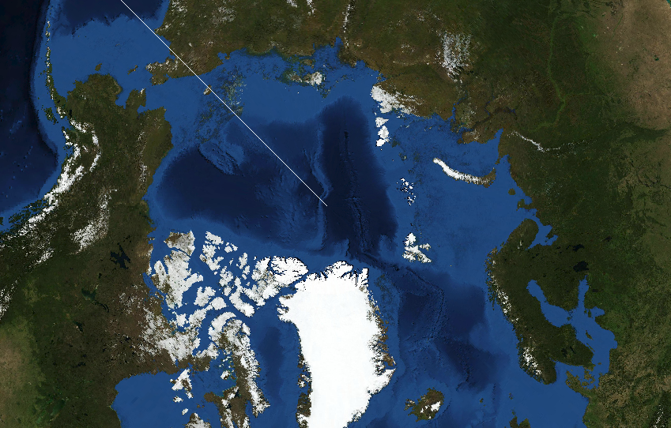

# 9. Coordinate reference systems

## Tutorial Objectives

This tutorial explains Coordinate Reference Systems (CRS) in the Geospatial
Explorer: why they matter, how the Explorer handles them, and how to configure
them.

By the end of this tutorial you will be able to:

- Understand why a map needs a CRS, and why you might choose a different one
  for your data or audience (for example, regional grids or polar views).
- Understand how the Explorer handles CRS — data is reprojected on the fly to
  the display CRS — and which CRS are supported out of the box
  (EPSG:3857, EPSG:4326, EPSG:3035, and the polar stereographic options).
- Understand how to set a different CRS as the default display for a
  configuration, and see the effect in Preview.
- Understand how to add an additional CRS to a configuration so it becomes
  available as the default or per-layer display option.

## Steps

- [9-1. Pre-requisites](01-prerequisites.md)
- [9-2. Key concepts](02-key-concepts.md)
- [9-3. Using an alternative projection](03-using-an-alternative-projection.md)
- [9-4. Defining a custom CRS](04-defining-a-custom-crs.md)
